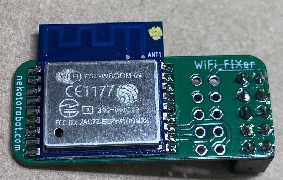
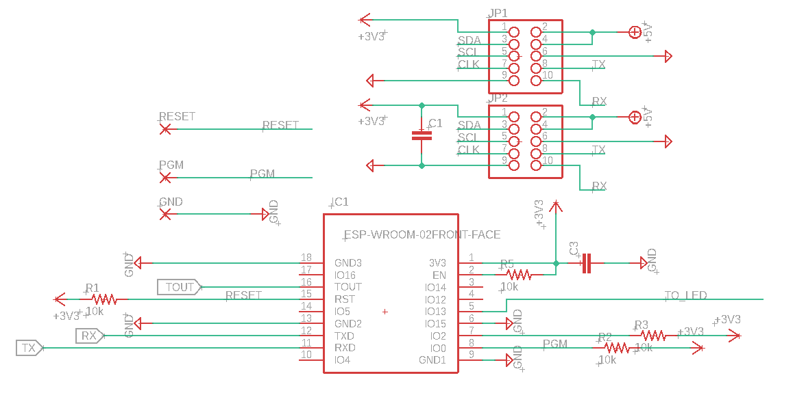
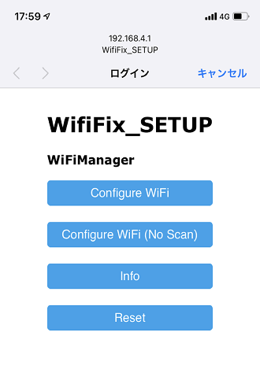
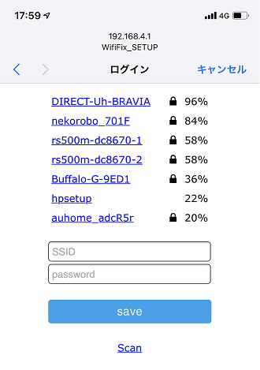

# wifi_fixer_esp8266

## What is this?
It is an ESP8266 board "wifi_fixer" for changing the Wifi setting of Raspberry Pi from the outside using a smartphone.

 

## How does it work?
Wifi_fixer acts as an independent wifi access point. When you connect to this access point with your smartphone
Display the menu using the built-in web server. Enter the SSID / PASS of the external access point through this menu.

With Raspberry Pi, serial communication is performed using / dev / serial0 through the Tx / RX pin.

### wifi_fixer.py
- Check if Wifi is available
- Inquire the wifi_fixer module by serial communication and check if SSID / PASS is entered.
- When a new SSID / PASS is entered, add it to /etc/wpa_supplicant/wpa_supplicant.conf
- Restart the raspberry pie

## Limits
--Only 2.4GHz wifi can be detected.
--If you have a large number of access points, you may not be able to find them.

## これは何？
ラズベリーパイのWifi設定を外部からスマートフォンを使って変更するためのESP8266ボード "wifi_fixer"です。

## どうやって動く？
Wifi_fixerは独立したwifiアクセスポイントとして動作します。スマートフォンでこのアクセスポイントに接続すると
内蔵したウェブサーバーを使ってメニューを表示します。このメニューを通じて外部のアクセスポイントのSSID/PASSの入力を行います。
ラズベリーパイとはTx/RXピンを通じ、/dev/serial0　を使ってシリアル通信を行います。

### wifi_fixer.py 
- Wifiが使用可能か調べる
- wifi_fixer モジュールにシリアル通信で問い合わせを行い、SSID/PASSが入力されているか調べる
- 新しいSSID/PASSが入力されたら、/etc/wpa_supplicant/wpa_supplicant.conf に追記
- ラズベリーパイをリスタート

## 制限
- 検出できるのは2.4GHz wifiのみです。
- 多数のアクセスポイントがある場合、発見できないことがあります。

